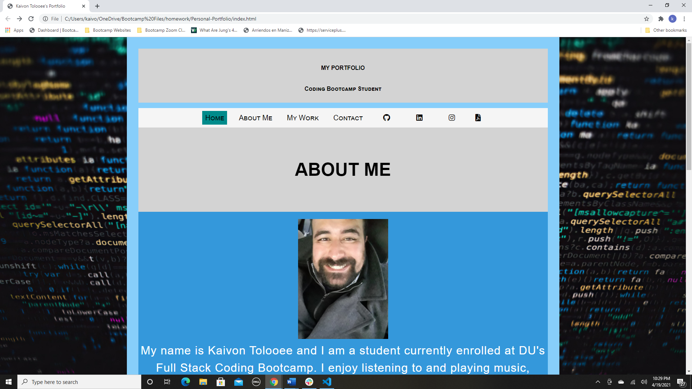

#Personal-Portolio

I created a responsive personal Portfolio so that anyone can look me up and find links to my projects, my professional pages and as well as my social links. 

I used HTML and CSS to make this portfolio and added images and clickable links to make it responsive for the viewer. 

Link to my github account: 

https://github.com/kaivont85/Personal-Portfolio

Screenshot of Deployed Website

  